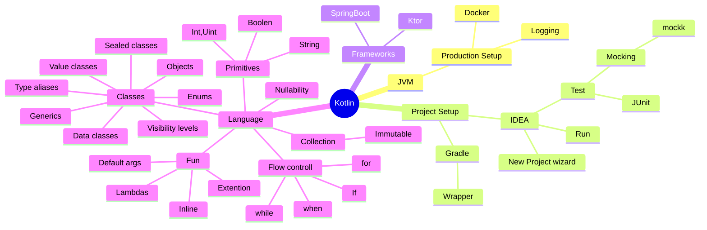

# Kotlin

## Knowledge graph

```mermaid
mindmap
    root((Kotlin))
        JVM
            Production Setup
                Docker
                Logging
        Project Setup
            Gradle
                Wrapper
            IDEA
                New Project wizard
                Run
                Test
                    JUnit
                    Mocking
                        mockk
        Frameworks
            SpringBoot
            Ktor 
        Language
            Primitives
                Int,Uint
                String
                Boolen
            Fun
                Default args
                Extention
                Lambdas
                Inline

            Nullability
            Flow controll
                If
                when
                for
                while
            Collection
                Immutable
            Classes
                Visibility levels
                Data classes
                Value classes
                Type aliases
                Sealed classes
                Objects
                Enums
                Generics

```
